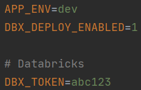

# Bricksflow Example Project

## 1. What's inside

This is a Bricksflow project skeleton covering our **best practices for Databricks projects**:

1. „One code for all environments“ (local IDE + Databricks UI)

1. Configuration management

1. Dependency management (packages)

1. Tables & schema management

1. Testing

1. Deployment

1. Productionalization

Let's **manage complex DataLakes together**!

## 2. Local environment setup

The following software needs to be installed first:
  * [Miniconda package manager](https://docs.conda.io/en/latest/miniconda.html)
  * [Git for Windows](https://git-scm.com/download/win) or standard Git in Linux (_apt-get install git_)
  * [PyCharm Community or Pro](https://www.jetbrains.com/pycharm/download/) with the [EnvFile plugin](https://plugins.jetbrains.com/plugin/7861-envfile) installed

Clone the repo now and prepare the package environment:

* On **Windows**, use Git Bash.
* On **Linux/Mac**, the use standard console 

```bash
$ git clone https://github.com/bricksflow/bricksflow.git
$ cd bricksflow
$ ./env-init.sh
```

When the environment setup is completed, update the `[PROJECT_ROOT]/.env` file with the appropriate values.



Now activate the Conda environment:

```bash
$ conda activate $PWD/.venv
```

or use a shortcut

```bash
$ ca
```

## 3. Important scripts

1. ```./pylint.sh``` - checks coding standards
1. ```./run_tests.sh``` - runs tests
